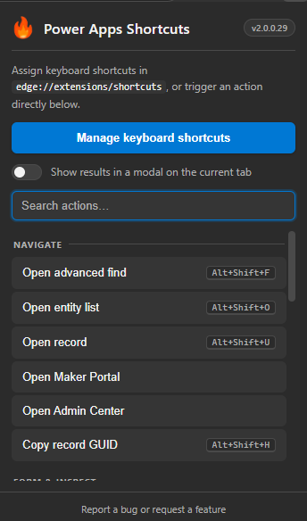
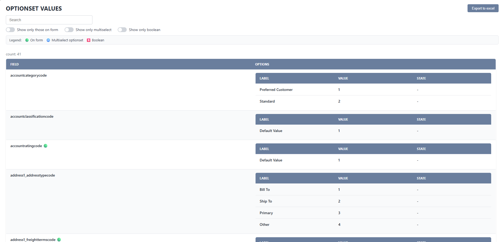
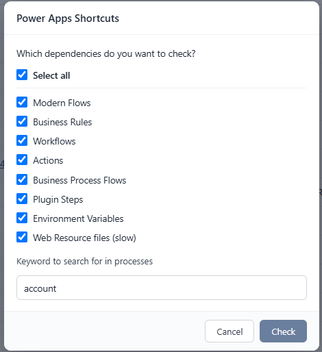
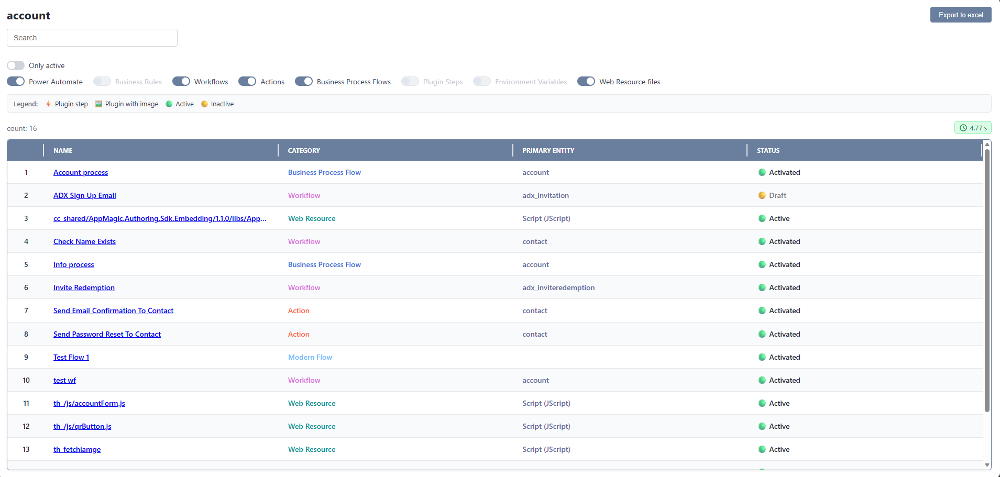
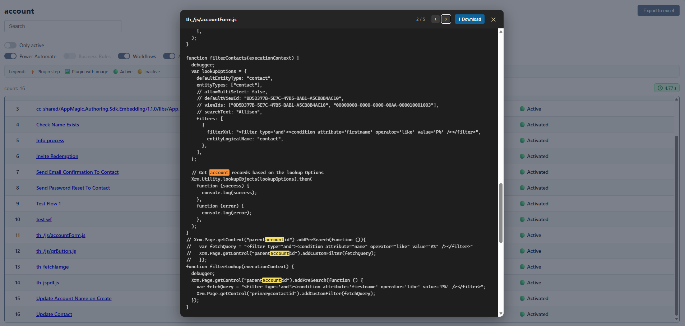
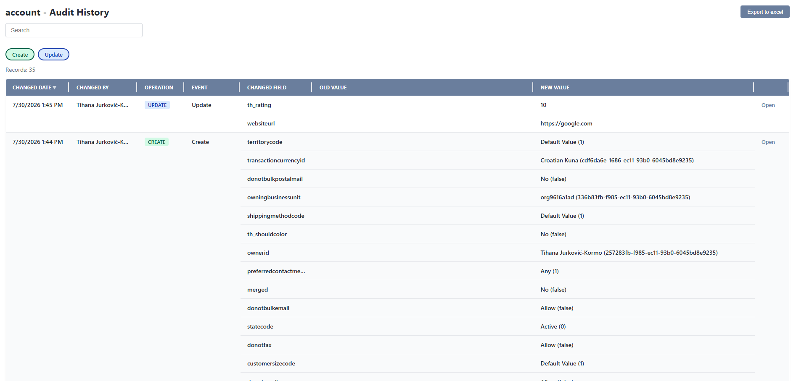

# 🔥 Power Apps Shortcuts

## Supercharge your Power Apps experience with custom keyboard shortcuts!

Power Apps Shortcuts is a productivity booster that helps you streamline common tasks with just a few keystrokes. No more endless clicking — configure your shortcuts once and get things done faster.

### ⚙️ How to Use

Start by setting up which keyboard shortcuts trigger which actions. Here's an example configuration to get you started:
| Shortcut | Action Description |
| ------------- | -------------------------------------------------------------- |
| `Alt+Shift+F` | Open Advanced Find |
| `Alt+Shift+G` | Enable God Mode |
| `Alt+Shift+R` | List Security Roles |
| `Alt+Shift+L` | Locate Field on Form |
| `Alt+Shift+O` | Open Entity List |
| `Alt+Shift+U` | Open Record |
| `Alt+Shift+M` | Quick Field Update |
| `Alt+Shift+C` | Toggle Ribbon Debug |
| `Alt+Shift+P` | View Option Sets (including multiselect & boolean) |
| `Alt+Shift+X` | Execute Retrieve with FetchXML |
| `Alt+Shift+I` | Display All Fields |
| `Alt+Shift+D` | List Field Dependencies (Flows, Plugins, Workflows, BRs, BPFs, Actions, Env Variables, Web Resources) |
| `Alt+Shift+H` | Copy Record GUID to Clipboard |
| `Alt+Shift+A` | Add Web Resource to a Solution |
| `Alt+Shift+S` | List Plugin Steps |
| `Alt+Shift+E` | List Script Events on the Form |
| `Alt+Shift+V` | List Environment Variables (view, edit & create values) |
| `Alt+Shift+T` | List Form Layout (tabs, sections & controls) |
| `Alt+Shift+Y` | Display Audit History for the Record |
| `Alt+Shift+W` | Show Unsaved (Dirty) Fields |
| `Alt+Shift+K` | Open Maker Portal for the Current Environment |
| `Alt+Shift+N` | Open Power Platform Admin Center for the Current Environment |

---

### Popup Launcher

Don't want to memorize shortcuts? Click the extension icon to open the popup, where every action is grouped and searchable — just type to filter and press <kbd>Enter</kbd> to run.

The popup also has a **"Show results in a modal on the current tab"** toggle:

- **Off (default):** views like Environment Variables, Dependencies, and Audit History open in a new browser tab.
- **On:** the same views open in an in-page modal overlay on the current tab. Close it with the ✕ button, by clicking the backdrop, or by pressing <kbd>Esc</kbd>.

Your choice is remembered across sessions.

---

### What Each Command Does

- **Open Advanced Find** — Opens the classic Advanced Find search window for the current environment.
- **Enable God Mode** — Unlocks the current form: makes hidden fields visible, read-only fields editable, and optional fields non-mandatory.
- **List Security Roles** — Lists the security roles in the environment (with first/last user context) so you can review who has what access.
- **Locate Field on Form** — Highlights and scrolls to a chosen field on the current form so you can find it quickly.
- **Open Entity List** — Prompts for an entity (table) logical name and opens its list view in a new tab.
- **Open Record** — Prompts for an entity name and record GUID, then opens that specific record in a new tab.
- **Quick Field Update** — Lets you update a field value on the current record directly, without opening the full editor.
- **Touch a Field** — Re-saves a field with its current value (no data change) to trigger plugins, workflows, or flows registered on the record's update.
- **Toggle Ribbon Debug** — Adds or removes `&ribbondebug=true` from the URL to turn command-bar (ribbon) debugging on or off.
- **Inspect Ribbon Buttons** — Lists every ribbon (command bar) button for the current table and, for each one, the JavaScript function it calls, a link to open that web resource code, and its visibility logic (enable and display rules). Reads the classic ribbon definitions via `RetrieveEntityRibbon`.
- **View Option Sets** — Displays the option set values (including multiselect and boolean fields) available on the current form.

  

- **Execute Retrieve with FetchXML** — Runs a FetchXML query against the environment and shows the returned records.
- **Display All Fields** — Lists every field on the current record along with its values, including those not shown on the form.
- **List Field Dependencies** — Shows components that reference the keyword (e.g. a field logical name): Flows, Plugins, Workflows, Business Rules, BPFs, Actions, and Environment Variables. You can also opt in to scan unmanaged JavaScript/HTML **web resource files** (a longer-running operation, with an optional name filter to narrow the scan); matching web resources open in an in-app code viewer with the keyword highlighted, match-to-match navigation (Enter / Shift+Enter), and a button to download the file. Results show the search execution time and can be filtered by type, active state, and text.

  

  

  

- **Copy Record GUID to Clipboard** — Copies the current record's GUID to your clipboard (reads it from the URL or the form).
- **Add Web Resource to a Solution** — Adds a web resource to a chosen solution.
- **List Plugin Steps** — Lists the registered plugin steps for the current context.
- **List Script Events on the Form** — Lists the JavaScript event handlers (OnLoad, OnChange, OnSave, etc.) wired up on the current form.
- **List Environment Variables** — Lists all environment variables and lets you view and edit their current and default values, or create a new environment variable (name, type, default and current value).
- **List Form Layout** — Displays the structure of the current form: tabs, sections, and controls.
- **Display Audit History for the Record** — Shows the audit history (changes over time) for the current record.

  

- **Show Unsaved (Dirty) Fields** — Lists the fields on the current form that have unsaved changes.
- **Open Maker Portal for the Current Environment** — Opens the Power Apps Maker Portal targeted at the current environment.
- **Open Power Platform Admin Center for the Current Environment** — Opens the Power Platform Admin Center targeted at the current environment.

---

### 💬 Feedback & Support

Have a suggestion, found a bug, or hit an error? Please open an issue on GitHub:

👉 [Report a bug or request a feature](https://github.com/tihanajk/Power-Apps-Shortcuts/issues)

When reporting a bug, include the steps to reproduce it, what you expected to happen, and any error messages (from the browser console if possible) so it can be fixed faster.

---

Customize it to fit your workflow and make Power Apps work for _you_. 🚀
